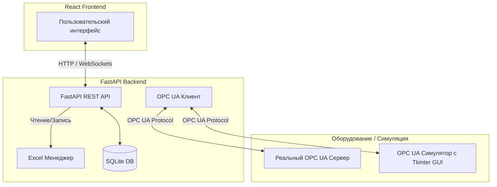

# Общий обзор проекта (Project Overview)

**Ekranchik-Modern** — это современная система мониторинга и управления для производственных процессов КПЗ (Камера полимеризации и закалки). Она обеспечивает сбор данных с оборудования по протоколу OPC UA, ведение учета в Excel-файлах, визуализацию параметров в реальном времени и интеграцию со сторонними системами (например, KTM-2000).

## Архитектура системы

Система состоит из трех основных компонентов:

### 1. Бэкенд (FastAPI Backend)
* **Технологии**: Python 3.10+, FastAPI, Uvicorn, SQLalchemy, Alembic, asyncua (OPC UA клиент), openpyxl.
* **Каталог**: [backend](file:///c:/Users/user/VibeCoding/ekranchik-modern/backend).
* **Порт**: `8000`.
* **Назначение**:
  - Предоставление REST API для фронтенда.
  - Постоянный опрос (polling) тегов OPC UA в фоновом режиме.
  - Запись данных в Excel-файлы учета (`.xlsm`), расположенные локально или на сетевом диске.
  - Управление локальной базой данных SQLite для хранения настроек, кэша вешал и событий выгрузки.
  - Переключение режимов работы (рабочий / тестовый).

### 2. Фронтенд (React Frontend)
* **Технологии**: React 18, Vite, TypeScript, Tailwind CSS, TanStack React Query, Lucide React.
* **Каталог**: [frontend](file:///c:/Users/user/VibeCoding/ekranchik-modern/frontend).
* **Порт**: `5173`.
* **Назначение**:
  - Отображение текущего состояния КПЗ (температуры, давления, статусы вешал).
  - Интерфейс для настройки путей к Excel-файлам.
  - Просмотр и редактирование параметров интеграции.
  - Панель управления для операторов.

### 3. Симулятор OPC UA (OPC UA Simulator)
* **Технологии**: Python, `freeopcua` (сервер), Tkinter (GUI-интерфейс).
* **Файл**: [opcua_server_simulator.py](file:///c:/Users/user/VibeCoding/ekranchik-modern/backend/opcua_server_simulator.py).
* **Порт**: `4840` (стандартный порт OPC UA).
* **Назначение**:
  - Имитация работы реального оборудования для разработки и тестирования.
  - Предоставление GUI на Tkinter для ручного изменения значений тегов (температуры, давления, концевиков дверей и т.д.) разработчиком или автоматизированными скриптами.

## Сетевые порты системы

| Порт | Компонент | Протокол | Назначение |
| :--- | :--- | :--- | :--- |
| `8000` | FastAPI Backend | HTTP | REST API, Swagger `/docs` |
| `5173` | React Frontend (Vite) | HTTP | Веб-интерфейс разработчика / оператора |
| `4840` | OPC UA Simulator / Server | TCP (OPC UA) | Обмен данными по протоколу OPC UA |
| `9222` | Chrome CDP | HTTP/WebSocket | Удаленная отладка Chrome для Playwright E2E тестов |

## Режимы работы бэкенда

1. **Рабочий режим (`SIMULATION_ENABLED=false` в `.env`)**:
   - Бэкенд подключается к реальному OPC UA серверу оборудования (`OPCUA_ENDPOINT`).
   - Используется сетевой путь к Excel-файлу учета (`EXCEL_REAL_FILE_PATH`).
2. **Тестовый режим (`SIMULATION_ENABLED=true` в `.env`)**:
   - Бэкенд подключается к локальному симулятору (`OPCUA_SIM_ENDPOINT`).
   - Используется локальный тестовый Excel-файл (`EXCEL_TEST_FILE_PATH`).
